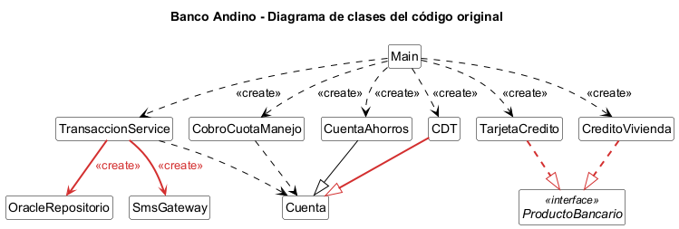

# Laboratorio L2: SOLID — Backend de Banco Andino

Ingeniería de Software II - Universidad Nacional de Colombia - Sede Bogotá - 2026

**Integrantes:**
- Jorge Andrés Hernández Garcia ([jorhernandezga@unal.edu.co](mailto:jorhernandezga@unal.edu.co))
- Juan Camilo Vergara Tao ([juvergarat@unal.edu.co](mailto:juvergarat@unal.edu.co))

**Lenguaje elegido:** Java 21

## Cómo ejecutar

Con Maven:

```bash
mvn compile exec:java
```

Sin Maven (solo JDK):

```bash
javac -encoding UTF-8 -d out src/main/java/*.java
java -Dstdout.encoding=UTF-8 -cp out Main
```

## Bloque 0 — Arranque

Se copió el código base entregado por el docente (11 archivos) sin modificar su diseño.
La salida del programa principal quedó guardada en `salida_original.txt` y servirá como
prueba de caracterización durante la refactorización.

## Bloque 1 — Diagnóstico

### 1.1 Tabla de hallazgos

| Clase / método | Letra | Evidencia en el código | Consecuencia para el banco o el cliente |
|---|---|---|---|
| `TransaccionService.transferir` | S | El método valida montos, calcula la comisión, mueve el dinero, guarda en Oracle, imprime el comprobante, envía el SMS y escribe la auditoría. Son siete tareas distintas en 36 líneas. | Si el área legal pide cambiar el texto del comprobante, hay que editar el mismo método que descuenta el dinero. Un error al tocar el formato puede terminar cobrando mal una transferencia, y cualquier cambio obliga a volver a probar todo el flujo. |
| `TransaccionService.transferir` (comprobante y auditoría) | S | El comprobante y la auditoría se arman con `System.out.println` directamente dentro del servicio, mezclados con la lógica del dinero. | No se puede reutilizar el comprobante para otros movimientos (por ejemplo, un pago) sin copiar y pegar esas líneas. Si mañana la auditoría debe ir a un archivo o a otro sistema, se toca de nuevo la clase más crítica. |
| `TransaccionService.transferir` (`switch (tipo)`) | O | La comisión se decide con un `switch` sobre un `String`. Agregar un tipo de transferencia exige editar ese `switch`. | Cada producto nuevo del área de negocio (por ejemplo, transferencias por llave) obliga a modificar código que ya funciona y que cobra a todos los clientes. Además, un tipo mal escrito (`"OTRO_BANCo"`) no lo detecta el compilador: el cliente solo ve el error cuando ya intentó transferir. |
| `TransaccionService.transferir` (notificación) | O | El único canal de aviso es `sms.enviar(...)`, escrito dentro del método. | Si el banco quiere avisar también por push o por correo, hay que abrir y modificar el método de transferencias. Lo mismo pasa con cualquier sistema que deba enterarse de cada transacción (por ejemplo, un control antifraude). |
| `TransaccionService` (atributo `repositorio`) | D | `private final OracleRepositorio repositorio = new OracleRepositorio();` La lógica de negocio depende directamente de la clase concreta de Oracle. | Cambiar de motor de base de datos (por ejemplo, dejar de pagar la licencia de Oracle) obliga a editar el servicio de transferencias. Además, cualquier prueba del servicio se conecta a la base de datos de producción. |
| `TransaccionService` (atributo `sms`) | D | `private final SmsGateway sms = new SmsGateway();` El servicio crea su propio proveedor de mensajería y no hay forma de reemplazarlo desde afuera. | Probar una transferencia le envía un SMS real a un cliente. Cambiar de proveedor de mensajería obliga a tocar la clase que mueve el dinero. |
| `CDT.retirar` | L | `CDT extends Cuenta`, pero su `retirar` lanza `UnsupportedOperationException` antes del vencimiento. Cualquier código que reciba una `Cuenta` asume que puede retirar. | El cobro nocturno de la cuota de manejo se cae en el primer CDT que encuentre. A las cuentas anteriores ya se les cobró y a las siguientes no, así que el banco deja de recaudar y toca revisar a mano a quién se le cobró. |
| `CobroCuotaManejo.cobrarMensual` | L | Recibe `List<Cuenta>` y llama `cuenta.retirar(CUOTA)` sin poder saber si es un CDT. El compilador acepta un CDT en esa lista. | El error solo aparece en producción, con datos reales. Si se repite el proceso después de la caída, se les puede cobrar dos veces la cuota a los clientes que ya habían pagado. |
| `ProductoBancario` | I | La interfaz obliga a todo producto a tener `depositar`, `retirar`, `calcularIntereses`, `pagarCuota` y `generarExtracto`, le apliquen o no. | Para cada producto nuevo hay que escribir métodos que no le corresponden, y cualquier cambio en la interfaz obliga a tocar todos los productos aunque no les afecte. |
| `CreditoVivienda.depositar`, `CreditoVivienda.retirar` y `TarjetaCredito.depositar` | I | Los tres métodos están vacíos, con el comentario `// no aplica`. | Si una pantalla o un proceso llama `retirar` sobre un crédito de vivienda o `depositar` sobre una tarjeta, no pasa nada y tampoco sale un error. El cliente cree que hizo una operación que en realidad nunca ocurrió y el banco no se entera. |

### 1.2 Experimentos

**Experimento 1: El CDT.**

Cambiamos temporalmente `Main.java` para que el cobro de la cuota de manejo también incluyera el
CDT de Ana:

```java
new CobroCuotaManejo().cobrarMensual(List.of(ana, cdtAna, luis));
```

**Resultado:** el programa compiló normal, sin errores ni advertencias. Al ejecutarlo salió esto:

```
Cuota de manejo cobrada a 001-1
[ERROR] ... An exception occurred while executing the Java class. Un CDT no permite retiros antes del vencimiento
```

A Ana sí le cobró la cuota, pero al llegar al CDT lanzó `UnsupportedOperationException` y el
programa se detuvo. A Luis no se le alcanzó a cobrar y los extractos que seguían tampoco se
imprimieron.

**Qué pasaría en producción:** si el proceso corre de noche para un millón de cuentas y la número
500 000 es un CDT, se les cobra a las primeras 499 999 y ahí se cae. La otra mitad queda sin
cobrar y no hay forma fácil de saber hasta dónde llegó. Si se vuelve a correr desde el principio,
a medio millón de clientes se les cobra dos veces, y si no se vuelve a correr, el banco deja de
recaudar medio millón de cuotas.

**Por qué pasa:** `Cuenta` da a entender que de cualquier cuenta se puede retirar, y `CDT` no lo
cumple. Como `CDT` hereda de `Cuenta`, el compilador lo acepta y el error solo aparece al
ejecutar.

**Experimento 2: La prueba imposible.**

Intentamos verificar que una transferencia a otro banco cobra $7.500 de comisión sin
conectarse a Oracle ni enviar un SMS. Este fue el intento:

```java
Cuenta origen = new CuentaAhorros("T-1", "Prueba", 1_000_000);
Cuenta destino = new CuentaAhorros("T-2", "Prueba2", 0);
new TransaccionService().transferir(origen, destino, 100_000, "OTRO_BANCO");
double esperado = 1_000_000 - 100_000 - 7_500;
// verificar que origen.getSaldo() == esperado
```

**Resultado:** no se logró cumplir la condición. La verificación del saldo sí pasa, pero
al ejecutarla la consola muestra `[ORACLE] INSERT INTO transacciones ...` y
`[SMS] Para Prueba: Transferiste ...`. Es decir, la "prueba" escribió en la base de datos
de producción y le mandó un mensaje a un cliente.

**Qué lo impide:** `TransaccionService` crea `OracleRepositorio` y `SmsGateway` con `new`
en sus propios atributos, que además son `private final`. No hay constructor ni método que
permita pasarle otra implementación (por ejemplo, un repositorio en memoria o un
notificador falso). Tampoco existen interfaces para esas dependencias, así que aunque
quisiéramos, no hay un "tipo" con el que crear un reemplazo. La única forma de probar la
comisión es ejecutar todo el flujo real.

### 1.3 Medición "antes"

| Métrica | Antes |
|---|---|
| Líneas del método `transferir` | 36 (de la firma a la llave de cierre, según la numeración del código entregado) |
| Número de razones distintas por las que `TransaccionService` podría cambiar | 7: validación de montos, reglas de comisión, movimiento del dinero, persistencia, formato del comprobante, notificación al cliente y auditoría |
| Clases concretas que `TransaccionService` crea con `new` | 2: `OracleRepositorio` y `SmsGateway` (sin contar las excepciones) |
| Métodos vacíos o que lanzan excepción por "no aplica" | 4: `TarjetaCredito.depositar`, `CreditoVivienda.depositar` y `CreditoVivienda.retirar` (vacíos), y `CDT.retirar` (lanza `UnsupportedOperationException`) |
| ¿Se puede probar `transferir` sin Oracle ni SMS? | No |

### 1.4 Diagrama de clases del código original



Las relaciones en rojo son las que consideramos problemáticas:

- `CDT` hereda de `Cuenta` pero no puede cumplir con `retirar` (L).
- `TarjetaCredito` y `CreditoVivienda` implementan una interfaz que les pide métodos que no les
  aplican (I).
- `TransaccionService` crea con `new` a `OracleRepositorio` y `SmsGateway` (D).

Los problemas de S y O no se ven en el diagrama porque están dentro del método `transferir`, no
en las relaciones entre clases.

## Bloque 2 — Refactorización

### Punto de control S

Se separaron las responsabilidades de `TransaccionService.transferir` en clases propias:
`ValidadorMonto`, `CalculadoraComision`, `GeneradorComprobante`, `NotificadorTransferencia`
y `RegistroAuditoria`. La persistencia ya estaba aislada en `OracleRepositorio`.

**¿Qué hace `TransaccionService`, en una frase?** Coordina los pasos de una transferencia.
Ya no aparece la "y": validar, calcular, guardar, imprimir, notificar y auditar los hace
cada clase; el servicio solo decide el orden y mueve el dinero entre las cuentas.

**Si el área legal pide cambiar el formato del comprobante, ¿qué archivo se toca?**
Solo `GeneradorComprobante.java`. El método que mueve el dinero no se abre.

**Nota:** el servicio todavía crea sus dependencias con `new`. Eso se corrige en el
punto de control D; en este punto solo se separaron responsabilidades.

### Punto de control O

El `switch` de comisiones se reemplazó por la interfaz `ReglaComision`, con una clase por
tipo de transferencia: `ComisionMismoBanco`, `ComisionOtroBanco` y `ComisionInternacional`.
`CalculadoraComision` recibe un mapa tipo → regla en su constructor y ya no conoce ningún
tipo concreto. El catálogo de tipos se arma en `Main`.

**Si mañana llega un tipo de transferencia nuevo, ¿qué archivos existentes hay que modificar?**
Solo `Main.java`, para registrar el tipo en el mapa. Lo demás es código nuevo: una clase
que implemente `ReglaComision`.

**Decisión:** para lograrlo, `TransaccionService` recibe la `CalculadoraComision` por su
constructor en vez de crearla. Si el mapa de tipos viviera dentro de la calculadora,
cada tipo nuevo obligaría a editarla. Las demás dependencias del servicio se inyectarán
en el punto de control D.

### Punto de control L

Nuestra solución detecta el error al compilar. `CDT` ya no hereda de `Cuenta`: las dos clases
heredan de `CuentaBase`, que no tiene el método `retirar`. Como `CobroCuotaManejo.cobrarMensual`
recibe una `List<Cuenta>`, intentar incluir un CDT produce el error `incompatible types` y el
programa no se construye.

Es mejor detectarlo al compilar porque el error lo ve el desarrollador en su computador, antes de
que el código llegue a producción. Al ejecutar, el error aparece con datos reales: en el
experimento 1 el proceso le cobró a Ana, se cayó en el CDT y nunca le cobró a Luis.

Envolver el retiro en un `try/catch` no resuelve el diseño porque el CDT seguiría prometiendo algo
que no cumple: `Cuenta` dice "se puede retirar" y el CDT no puede. Cada lugar que use una `Cuenta`
tendría que acordarse de poner su propio `try/catch`, y el que lo olvide vuelve a fallar. Además,
ignorar la excepción esconde también errores legítimos, como un saldo insuficiente, y el banco
dejaría de cobrar sin que nadie se entere.
