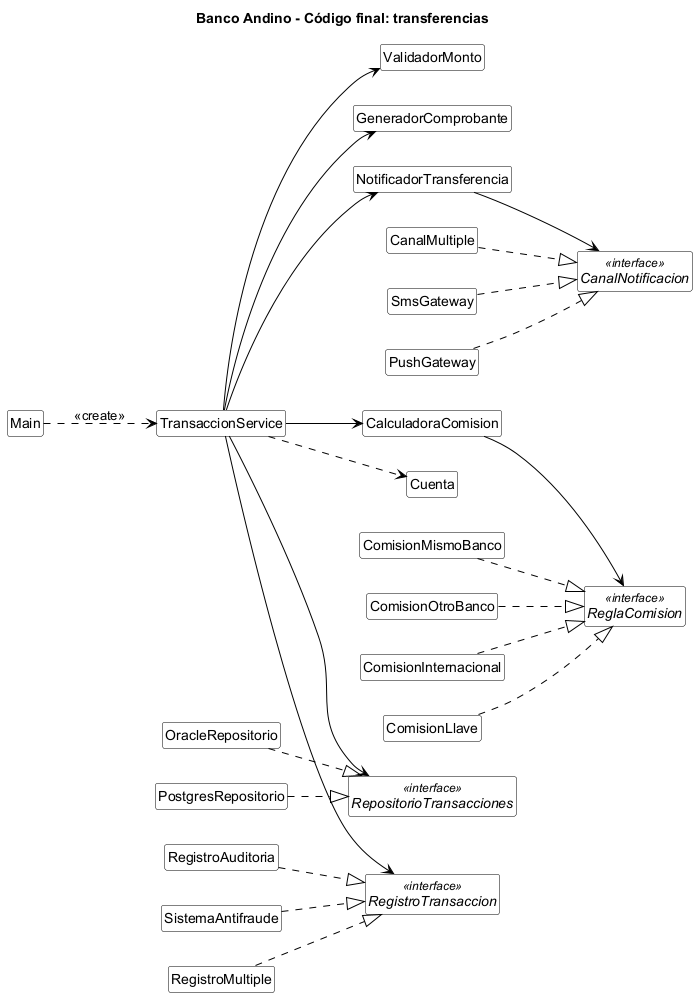
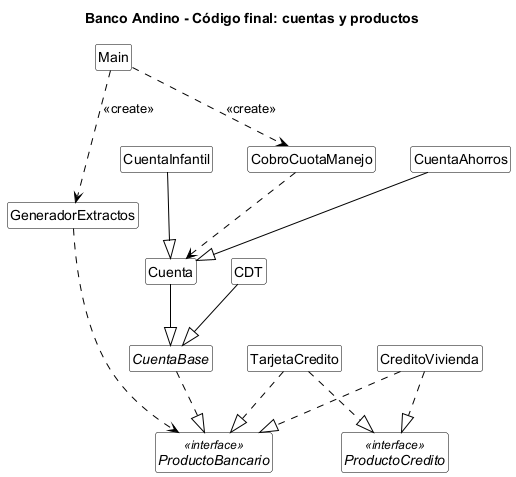

# Laboratorio L2: SOLID — Backend de Banco Andino

Ingeniería de Software II - Universidad Nacional de Colombia - Sede Bogotá - 2026

**Integrantes:**
- Jorge Andrés Hernández Garcia ([jorhernandezga@unal.edu.co](mailto:jorhernandezga@unal.edu.co))
- Juan Camilo Vergara Tao ([juvergarat@unal.edu.co](mailto:juvergarat@unal.edu.co))

**Lenguaje elegido:** Java 21

## Cómo ejecutar

Con Maven:

```bash
mvn compile exec:java
```

Sin Maven (solo JDK):

```bash
javac -encoding UTF-8 -d out src/main/java/*.java
java -Dstdout.encoding=UTF-8 -cp out Main
```

## Bloque 0 — Arranque

Se copió el código base entregado por el docente (11 archivos) sin modificar su diseño.
La salida del programa principal quedó guardada en `salida_original.txt` y servirá como
prueba de caracterización durante la refactorización.

## Bloque 1 — Diagnóstico

### 1.1 Tabla de hallazgos

| Clase / método | Letra | Evidencia en el código | Consecuencia para el banco o el cliente |
|---|---|---|---|
| `TransaccionService.transferir` | S | El método valida montos, calcula la comisión, mueve el dinero, guarda en Oracle, imprime el comprobante, envía el SMS y escribe la auditoría. Son siete tareas distintas en 36 líneas. | Si el área legal pide cambiar el texto del comprobante, hay que editar el mismo método que descuenta el dinero. Un error al tocar el formato puede terminar cobrando mal una transferencia, y cualquier cambio obliga a volver a probar todo el flujo. |
| `TransaccionService.transferir` (comprobante y auditoría) | S | El comprobante y la auditoría se arman con `System.out.println` directamente dentro del servicio, mezclados con la lógica del dinero. | No se puede reutilizar el comprobante para otros movimientos (por ejemplo, un pago) sin copiar y pegar esas líneas. Si mañana la auditoría debe ir a un archivo o a otro sistema, se toca de nuevo la clase más crítica. |
| `TransaccionService.transferir` (`switch (tipo)`) | O | La comisión se decide con un `switch` sobre un `String`. Agregar un tipo de transferencia exige editar ese `switch`. | Cada producto nuevo del área de negocio (por ejemplo, transferencias por llave) obliga a modificar código que ya funciona y que cobra a todos los clientes. Además, un tipo mal escrito (`"OTRO_BANCo"`) no lo detecta el compilador: el cliente solo ve el error cuando ya intentó transferir. |
| `TransaccionService.transferir` (notificación) | O | El único canal de aviso es `sms.enviar(...)`, escrito dentro del método. | Si el banco quiere avisar también por push o por correo, hay que abrir y modificar el método de transferencias. Lo mismo pasa con cualquier sistema que deba enterarse de cada transacción (por ejemplo, un control antifraude). |
| `TransaccionService` (atributo `repositorio`) | D | `private final OracleRepositorio repositorio = new OracleRepositorio();` La lógica de negocio depende directamente de la clase concreta de Oracle. | Cambiar de motor de base de datos (por ejemplo, dejar de pagar la licencia de Oracle) obliga a editar el servicio de transferencias. Además, cualquier prueba del servicio se conecta a la base de datos de producción. |
| `TransaccionService` (atributo `sms`) | D | `private final SmsGateway sms = new SmsGateway();` El servicio crea su propio proveedor de mensajería y no hay forma de reemplazarlo desde afuera. | Probar una transferencia le envía un SMS real a un cliente. Cambiar de proveedor de mensajería obliga a tocar la clase que mueve el dinero. |
| `CDT.retirar` | L | `CDT extends Cuenta`, pero su `retirar` lanza `UnsupportedOperationException` antes del vencimiento. Cualquier código que reciba una `Cuenta` asume que puede retirar. | El cobro nocturno de la cuota de manejo se cae en el primer CDT que encuentre. A las cuentas anteriores ya se les cobró y a las siguientes no, así que el banco deja de recaudar y toca revisar a mano a quién se le cobró. |
| `CobroCuotaManejo.cobrarMensual` | L | Recibe `List<Cuenta>` y llama `cuenta.retirar(CUOTA)` sin poder saber si es un CDT. El compilador acepta un CDT en esa lista. | El error solo aparece en producción, con datos reales. Si se repite el proceso después de la caída, se les puede cobrar dos veces la cuota a los clientes que ya habían pagado. |
| `ProductoBancario` | I | La interfaz obliga a todo producto a tener `depositar`, `retirar`, `calcularIntereses`, `pagarCuota` y `generarExtracto`, le apliquen o no. | Para cada producto nuevo hay que escribir métodos que no le corresponden, y cualquier cambio en la interfaz obliga a tocar todos los productos aunque no les afecte. |
| `CreditoVivienda.depositar`, `CreditoVivienda.retirar` y `TarjetaCredito.depositar` | I | Los tres métodos están vacíos, con el comentario `// no aplica`. | Si una pantalla o un proceso llama `retirar` sobre un crédito de vivienda o `depositar` sobre una tarjeta, no pasa nada y tampoco sale un error. El cliente cree que hizo una operación que en realidad nunca ocurrió y el banco no se entera. |

### 1.2 Experimentos

**Experimento 1: El CDT.**

Cambiamos temporalmente `Main.java` para que el cobro de la cuota de manejo también incluyera el
CDT de Ana:

```java
new CobroCuotaManejo().cobrarMensual(List.of(ana, cdtAna, luis));
```

**Resultado:** el programa compiló normal, sin errores ni advertencias. Al ejecutarlo salió esto:

```
Cuota de manejo cobrada a 001-1
[ERROR] ... An exception occurred while executing the Java class. Un CDT no permite retiros antes del vencimiento
```

A Ana sí le cobró la cuota, pero al llegar al CDT lanzó `UnsupportedOperationException` y el
programa se detuvo. A Luis no se le alcanzó a cobrar y los extractos que seguían tampoco se
imprimieron.

**Qué pasaría en producción:** si el proceso corre de noche para un millón de cuentas y la número
500 000 es un CDT, se les cobra a las primeras 499 999 y ahí se cae. La otra mitad queda sin
cobrar y no hay forma fácil de saber hasta dónde llegó. Si se vuelve a correr desde el principio,
a medio millón de clientes se les cobra dos veces, y si no se vuelve a correr, el banco deja de
recaudar medio millón de cuotas.

**Por qué pasa:** `Cuenta` da a entender que de cualquier cuenta se puede retirar, y `CDT` no lo
cumple. Como `CDT` hereda de `Cuenta`, el compilador lo acepta y el error solo aparece al
ejecutar.

**Experimento 2: La prueba imposible.**

Intentamos verificar que una transferencia a otro banco cobra $7.500 de comisión sin
conectarse a Oracle ni enviar un SMS. Este fue el intento:

```java
Cuenta origen = new CuentaAhorros("T-1", "Prueba", 1_000_000);
Cuenta destino = new CuentaAhorros("T-2", "Prueba2", 0);
new TransaccionService().transferir(origen, destino, 100_000, "OTRO_BANCO");
double esperado = 1_000_000 - 100_000 - 7_500;
// verificar que origen.getSaldo() == esperado
```

**Resultado:** no se logró cumplir la condición. La verificación del saldo sí pasa, pero
al ejecutarla la consola muestra `[ORACLE] INSERT INTO transacciones ...` y
`[SMS] Para Prueba: Transferiste ...`. Es decir, la "prueba" escribió en la base de datos
de producción y le mandó un mensaje a un cliente.

**Qué lo impide:** `TransaccionService` crea `OracleRepositorio` y `SmsGateway` con `new`
en sus propios atributos, que además son `private final`. No hay constructor ni método que
permita pasarle otra implementación (por ejemplo, un repositorio en memoria o un
notificador falso). Tampoco existen interfaces para esas dependencias, así que aunque
quisiéramos, no hay un "tipo" con el que crear un reemplazo. La única forma de probar la
comisión es ejecutar todo el flujo real.

### 1.3 Medición "antes"

| Métrica | Antes |
|---|---|
| Líneas del método `transferir` | 36 (de la firma a la llave de cierre, según la numeración del código entregado) |
| Número de razones distintas por las que `TransaccionService` podría cambiar | 7: validación de montos, reglas de comisión, movimiento del dinero, persistencia, formato del comprobante, notificación al cliente y auditoría |
| Clases concretas que `TransaccionService` crea con `new` | 2: `OracleRepositorio` y `SmsGateway` (sin contar las excepciones) |
| Métodos vacíos o que lanzan excepción por "no aplica" | 4: `TarjetaCredito.depositar`, `CreditoVivienda.depositar` y `CreditoVivienda.retirar` (vacíos), y `CDT.retirar` (lanza `UnsupportedOperationException`) |
| ¿Se puede probar `transferir` sin Oracle ni SMS? | No |

### 1.4 Diagrama de clases del código original


Las relaciones en rojo son las que consideramos problemáticas:

- `CDT` hereda de `Cuenta` pero no puede cumplir con `retirar` (L).
- `TarjetaCredito` y `CreditoVivienda` implementan una interfaz que les pide métodos que no les
  aplican (I).
- `TransaccionService` crea con `new` a `OracleRepositorio` y `SmsGateway` (D).

Los problemas de S y O no se ven en el diagrama porque están dentro del método `transferir`, no
en las relaciones entre clases.

## Bloque 2 — Refactorización

### Punto de control S

Se separaron las responsabilidades de `TransaccionService.transferir` en clases propias:
`ValidadorMonto`, `CalculadoraComision`, `GeneradorComprobante`, `NotificadorTransferencia`
y `RegistroAuditoria`. La persistencia ya estaba aislada en `OracleRepositorio`.

**¿Qué hace `TransaccionService`, en una frase?** Coordina los pasos de una transferencia.
Ya no aparece la "y": validar, calcular, guardar, imprimir, notificar y auditar los hace
cada clase; el servicio solo decide el orden y mueve el dinero entre las cuentas.

**Si el área legal pide cambiar el formato del comprobante, ¿qué archivo se toca?**
Solo `GeneradorComprobante.java`. El método que mueve el dinero no se abre.

**Nota:** el servicio todavía crea sus dependencias con `new`. Eso se corrige en el
punto de control D; en este punto solo se separaron responsabilidades.

### Punto de control O

El `switch` de comisiones se reemplazó por la interfaz `ReglaComision`, con una clase por
tipo de transferencia: `ComisionMismoBanco`, `ComisionOtroBanco` y `ComisionInternacional`.
`CalculadoraComision` recibe un mapa tipo → regla en su constructor y ya no conoce ningún
tipo concreto. El catálogo de tipos se arma en `Main`.

**Si mañana llega un tipo de transferencia nuevo, ¿qué archivos existentes hay que modificar?**
Solo `Main.java`, para registrar el tipo en el mapa. Lo demás es código nuevo: una clase
que implemente `ReglaComision`.

**Decisión:** para lograrlo, `TransaccionService` recibe la `CalculadoraComision` por su
constructor en vez de crearla. Si el mapa de tipos viviera dentro de la calculadora,
cada tipo nuevo obligaría a editarla. Las demás dependencias del servicio se inyectarán
en el punto de control D.

### Punto de control L

Nuestra solución detecta el error al compilar. `CDT` ya no hereda de `Cuenta`: las dos clases
heredan de `CuentaBase`, que no tiene el método `retirar`. Como `CobroCuotaManejo.cobrarMensual`
recibe una `List<Cuenta>`, intentar incluir un CDT produce el error `incompatible types` y el
programa no se construye.

Es mejor detectarlo al compilar porque el error lo ve el desarrollador en su computador, antes de
que el código llegue a producción. Al ejecutar, el error aparece con datos reales: en el
experimento 1 el proceso le cobró a Ana, se cayó en el CDT y nunca le cobró a Luis.

Envolver el retiro en un `try/catch` no resuelve el diseño porque el CDT seguiría prometiendo algo
que no cumple: `Cuenta` dice "se puede retirar" y el CDT no puede. Cada lugar que use una `Cuenta`
tendría que acordarse de poner su propio `try/catch`, y el que lo olvide vuelve a fallar. Además,
ignorar la excepción esconde también errores legítimos, como un saldo insuficiente, y el banco
dejaría de cobrar sin que nadie se entere.

### Punto de control I

Sí. `GeneradorExtractos` recibe una lista de `ProductoBancario` e imprime el extracto de cada
elemento, y funciona igual con cuentas de ahorros, CDT, tarjetas de crédito y créditos de vivienda.
Lo probamos con una lista que mezclaba los cuatro y los imprimió todos.

La única interfaz que necesitó es `ProductoBancario`, que quedó con un solo método:
`generarExtracto()`. Los métodos de intereses y de pago de cuota pasaron a otra interfaz,
`ProductoCredito`, que solo implementan la tarjeta y el crédito de vivienda.

El generador no necesita conocer los demás métodos porque lo único que hace es pedir el extracto.
No le importa si el producto permite retirar, depositar o pagar cuotas, así que no depende de
ellos. Por eso ya no hay métodos vacíos: `TarjetaCredito` perdió su `depositar` y `CreditoVivienda`
perdió su `depositar` y su `retirar`, que antes existían solo porque la interfaz los exigía.

### Punto de control D

`TransaccionService` ya no crea nada con `new`. Todas sus piezas le llegan por el constructor.
Para los dos sistemas externos creamos una interfaz por cada uno: `RepositorioTransacciones`, que
implementa `OracleRepositorio`, y `CanalNotificacion`, que implementa `SmsGateway`.

El servicio ya no conoce ninguna clase de infraestructura: no nombra a `OracleRepositorio` ni a
`SmsGateway`. Sí conoce cinco clases propias del flujo, que recibe ya construidas: `ValidadorMonto`,
`CalculadoraComision`, `GeneradorComprobante`, `NotificadorTransferencia` y `RegistroAuditoria`.
A esas no les pusimos interfaz porque hoy solo existe una versión de cada una, y crear una interfaz
para cada una sería agregar archivos que todavía no aportan nada.

Quien decide si se usa Oracle o si se notifica por SMS es `Main.java`. Es el único archivo que
nombra esas dos clases, así que cambiar de base de datos o de canal es cambiar una línea ahí.

Volvimos al experimento 2 y ahora sí es posible. Armamos el servicio con un repositorio falso que
guarda en una lista y un canal falso que anota los mensajes. La transferencia a otro banco dejó
el saldo de origen en $892.500 (1.000.000 menos 100.000 menos 7.500), se guardó una vez con
comisión de 7.500 y generó un mensaje. En la consola no apareció ninguna línea `[ORACLE]` ni
`[SMS]`.

## Bloque 3 — Pruebas unitarias

Las pruebas están en `src/test/java/TransaccionServiceTest.java` y se ejecutan con `mvn test`.
Son las cinco que pide la guía:

1. Una transferencia al mismo banco no cobra comisión y mueve exactamente el monto.
2. Una transferencia a otro banco cobra $7.500 y descuenta monto más comisión del origen.
3. Con saldo insuficiente la transferencia se rechaza y no se guarda ni se notifica.
4. Una transferencia exitosa se guarda una sola vez y genera una sola notificación.
5. Un tipo de transferencia desconocido se rechaza y el saldo de origen no cambia.

Usamos dos dobles de prueba escritos a mano, sin framework de mocks: `RepositorioEnMemoria`, que
implementa `RepositorioTransacciones` y guarda las transacciones en una lista, y `CanalFalso`, que
implementa `CanalNotificacion` y anota los mensajes en vez de enviarlos.

**¿Cuánto tardan en ejecutarse todas las pruebas?** Las cinco tardan 0,07 segundos según el
reporte de Maven. Ninguna se conecta a Oracle ni envía un SMS.

**¿Cuántas líneas de `TransaccionService` tuvieron que cambiar para poder probarla?** Para
escribir las pruebas, ninguna. El cambio que permitió probarla fue el del punto de control D: se
quitaron las 6 líneas donde el servicio creaba sus dependencias con `new` y se agregaron 13 con
los atributos y el constructor que las recibe. El método `transferir` no se tocó.

**¿Qué habría pasado si intentáramos estas pruebas en el bloque 1?** No se habrían podido
escribir cumpliendo la condición. El servicio creaba su propio `OracleRepositorio` y su propio
`SmsGateway`, así que cada prueba habría escrito en la base de datos de producción y le habría
enviado un SMS a un cliente, como pasó en el experimento 2. Tampoco se habría podido comprobar
que una transferencia rechazada no guarda nada, porque no había forma de mirar qué se guardó.

## Bloque 4 — Negocio pidió cambios

La estimación se hizo antes de programar cada requerimiento, mirando el código original del
commit `bloque-0-codigo-base`. Las columnas de archivos cuentan solo código (no el README).

| Req. | Archivos a modificar en el código original (estimado) | Archivos existentes modificados (real) | Archivos nuevos | ¿Se rompió alguna prueba? |
|---|---|---|---|---|
| R1 | 1 (`TransaccionService`) | 1 (`Main`) | 2 (`ComisionLlave` y su prueba `TransferenciaLlaveTest`) | No |
| R2 | 4 (`Main`, `Cuenta`, `CobroCuotaManejo`, `TransaccionService`) | 0 | 2 (`CuentaInfantil` y su prueba `CuentaInfantilTest`) | No |
| R3 | 2 (`TransaccionService`, `SmsGateway`) | 1 (`Main`) | 3 (`PushGateway`, `CanalMultiple` y su prueba `CanalMultipleTest`) | No |
| R4 | 2 (`TransaccionService`, `OracleRepositorio`) | 3 (`TransaccionService`, `RegistroAuditoria`, `Main`) | 5 (`RegistroTransaccion`, `SistemaAntifraude`, `RegistroMultiple`, el doble `RegistroFalso` y la prueba `RegistroTransaccionTest`) | No |
| R5 | 3 (`TransaccionService`, `Main`, `OracleRepositorio`) | 1 (`Main`) | 1 (`PostgresRepositorio`) | No |

En total, sumando los cinco requerimientos, se modificaron 6 veces archivos existentes. Son 3
archivos distintos: `Main` (en R1, R3, R4 y R5), `TransaccionService` y `RegistroAuditoria` (los
dos en R4). La estimación sobre el código original sumaba 12.

**R1: Transferencias por llave.** Se creó la regla `ComisionLlave`, que devuelve comisión 0, y se
registró el tipo `LLAVE` en el mapa de `Main`. En el código original habría que haber editado el
`switch` de `TransaccionService`. La prueba nueva comprueba el criterio de aceptación: una
transferencia de $50.000 por llave descuenta exactamente $50.000 del origen.

**R2: Cuenta infantil.** Se creó `CuentaInfantil`, que hereda de `Cuenta` y lleva el acumulado de
retiros del día. Como es una `Cuenta`, funciona como origen de transferencias y en el cobro de
cuota de manejo sin tocar `TransaccionService` ni `CobroCuotaManejo`. La estimación fue más alta
que lo real: en el código original tampoco hacía falta editar esas clases, porque ya recibían
cualquier `Cuenta`. Queda una limitación: la cuota de manejo se cobra con `retirar`, así que
cuenta para el tope diario. Si la cuenta ya retiró más de $187.100 ese día, el cobro de la cuota
se rechazaría.

**R3: Notificaciones push.** Se creó `PushGateway`, otro `CanalNotificacion` como `SmsGateway`, y
`CanalMultiple`, un canal que reenvía el mensaje a una lista de canales. En `Main` se cambió una
línea para armar el canal con SMS y push. `NotificadorTransferencia` no se tocó, porque para él
sigue siendo un solo canal. Al ejecutar el programa, por la transferencia aparecen las líneas
`[SMS]` y una línea `[PUSH]`. Desde aquí la salida del programa ya no es igual a
`salida_original.txt`, porque se agregó funcionalidad.

**R4: Sistema antifraude.** Este fue el requerimiento que el diseño no aguantó sin cambios. En el
punto de control D no le pusimos interfaz a la auditoría porque solo existía una versión, así que
`TransaccionService` recibía directamente un `RegistroAuditoria`. Para agregar el antifraude hubo
que crear la interfaz `RegistroTransaccion`, hacer que `RegistroAuditoria` la implemente y cambiar
el tipo del atributo y del parámetro en `TransaccionService`. Fueron 3 líneas en total entre las
dos clases, y el método `transferir` no se tocó. Después se creó `SistemaAntifraude` y
`RegistroMultiple`, que reparte el registro a los dos. Las cinco pruebas del bloque 3 siguieron
pasando sin modificarlas. Al ejecutar el programa aparecen la línea `[AUDITORIA]` y la línea
`[ANTIFRAUDE]`, y la prueba nueva comprueba que una transferencia rechazada no genera ninguna.

**R5: Migración a PostgreSQL.** Se creó `PostgresRepositorio`, que implementa
`RepositorioTransacciones`, y en `Main` se cambió una línea: `new OracleRepositorio()` pasó a
`new PostgresRepositorio()`. `OracleRepositorio` sigue en el proyecto sin cambios, por si hay que
devolverse. `TransaccionService` no se tocó, porque solo conoce la interfaz. Al ejecutar el
programa las dos primeras líneas ahora dicen `[POSTGRES]` en vez de `[ORACLE]`, y las pruebas
unitarias no cambiaron.

## Bloque 5 — Revisión cruzada

La rama de la revisión cruzada no se integra a `main`: se deja aparte y se referencia aquí.

### Nuestra revisión del código de la otra pareja

Implementamos R6 (pago de servicios públicos) sobre el repositorio
[feliariasg/LabSolid](https://github.com/feliariasg/LabSolid), en una rama, con el commit
`revision-cruzada`. Quedó en el
[pull request 3](https://github.com/feliariasg/LabSolid/pull/3) de ese repositorio.

Se agregó la comisión fija de $1.500, un servicio de pago de servicios y dos pruebas: una con el
criterio de aceptación y otra con saldo insuficiente. De las clases que ya existían solo se
modificó `Main.java`, para registrar la comisión y armar el servicio. Las pruebas que ya tenían
siguieron pasando, para un total de 15. La lista de revisión que les entregamos está en el archivo
`REVISION_CRUZADA.md` de esa rama.

### La revisión que recibimos de la otra pareja

La rama de la revisión que recibimos de la otra pareja está con el nombre de `revision-cruzada`, quedó con el [pull request 1](https://github.com/andreshern7/SOLID2-Ingesoft-II/pull/1) de este repositorio,y la lista se ve en el `REVISION_CRUZADA.md` de la mencionada `revision-cruzada`.

## Bloque 6 — Cierre

### Diagramas de clases, antes y después

**Antes (bloque 1):**


**Después (código final):**

El diagrama final se partió en dos para que se pueda leer: uno con el flujo de transferencias y
otro con las cuentas y los productos. Solo `Main` y `Cuenta` aparecen en los dos.





En el diagrama final ya no hay relaciones en rojo. `CDT` y `Cuenta` heredan de `CuentaBase`, los
productos de crédito implementan solo las interfaces que les aplican, y `TransaccionService` apunta
a interfaces (`RepositorioTransacciones`, `RegistroTransaccion`) en vez de a `OracleRepositorio` y
`SmsGateway`. `Main` es el único que crea los objetos y los conecta.

### Tabla comparativa

| Métrica | Antes | Después |
|---|---|---|
| Líneas del método `transferir` | 36 | 12 |
| Razones distintas por las que `TransaccionService` podría cambiar | 7 | 1: que cambien los pasos de una transferencia o su orden |
| Clases concretas que `TransaccionService` crea con `new` | 2 | 0 |
| Métodos vacíos o que lanzan "no aplica" | 4 | 0 |
| ¿Se puede probar `transferir` sin Oracle ni SMS? | No | Sí (12 pruebas, menos de un segundo) |
| Número total de archivos | 11 | 41 (33 de código y 8 de pruebas) |
| Archivos existentes modificados en total en el bloque 4 | 6 modificaciones, sobre 3 archivos distintos | |

### Reflexión

**(a) El código final tiene muchos más archivos que el original. ¿Es eso un problema? ¿En qué
situación sí lo sería?**

En este caso no. Pasamos de 11 archivos a 33 de código, pero cada uno es corto y hace una sola
cosa, así que para un cambio casi siempre se sabe cuál abrir. En el bloque 4 eso se notó: cuatro de
los cinco requerimientos se resolvieron creando clases nuevas y tocando una línea de `Main`.

Sí sería un problema si los archivos se crean sin necesidad. Por ejemplo, si le hubiéramos puesto
una interfaz a cada clase desde el punto de control D, tendríamos cuatro interfaces más con una
sola implementación cada una, que solo sirven para dar más vueltas al leer el código. También sería
un problema en un programa pequeño que no va a cambiar: ahí partirlo en tantas piezas cuesta más de
lo que ahorra.

**(b) ¿En qué requerimiento del bloque 4 se notó más la diferencia entre el código original y el
refactorizado? ¿Por qué?**

En R5, la migración a PostgreSQL. En el código original `TransaccionService` creaba su propio
`OracleRepositorio` con `new`, así que cambiar de base de datos obligaba a abrir la clase que mueve
el dinero. Nuestra estimación fue de 3 archivos a modificar. En el código refactorizado fue una
clase nueva (`PostgresRepositorio`) y una línea en `Main`. `TransaccionService` no se tocó y las
pruebas no cambiaron, porque el servicio solo conoce la interfaz `RepositorioTransacciones`.

R3 (push) fue parecido: se resolvió con dos clases nuevas y una línea en `Main`, cuando en el
original había que editar el método `transferir`.

**(c) ¿Hubo algún requerimiento que su diseño no aguantó bien? ¿Qué cambiarían?**

Sí, R4 (antifraude). En el punto de control D decidimos no ponerle interfaz a la auditoría porque
solo existía una versión, y `TransaccionService` recibía directamente un `RegistroAuditoria`.
Cuando llegó el antifraude tuvimos que crear la interfaz `RegistroTransaccion` y modificar dos
clases existentes del flujo: `RegistroAuditoria` y `TransaccionService`. Fueron 3 líneas y las
pruebas siguieron pasando, pero fue el único requerimiento que obligó a tocar el servicio.

No creemos que la decisión del punto D haya sido un error, porque crear la interfaz antes de tener
la segunda implementación habría sido adivinar. Lo que cambiaríamos es que, al separar
responsabilidades, todo lo que es "avisarle a otro sistema" (guardar, notificar, auditar) quede
desde el principio detrás de una interfaz, porque son los puntos donde es más probable que
aparezca un segundo destino.

**(d) ¿Qué les dijo la otra pareja en la revisión cruzada? ¿Están de acuerdo?**

Pendiente. A la fecha de este commit la otra pareja todavía no ha entregado su pull request ni
su lista de revisión. Esta respuesta se completa cuando la recibamos.

**(e) Si tuvieran que convencer a su jefe de invertir dos semanas en refactorizar el backend real
del banco, ¿qué argumento usarían, basándose en los datos de hoy?**

Usaríamos tres datos de este laboratorio.

El primero es el costo de cada cambio. Para los cinco requerimientos del negocio estimamos 12
archivos por modificar en el código original, y `TransaccionService` aparecía en las cinco
estimaciones. Con el código refactorizado fueron 6 modificaciones sobre 3 archivos, y la clase que
mueve el dinero se tocó una sola vez, en 2 líneas. Cada vez que no se toca esa clase es un riesgo
menos de cobrar mal una transferencia.

El segundo es que ahora se puede probar. Antes era imposible probar una transferencia sin
escribir en la base de datos de producción y sin enviarle un SMS a un cliente. Ahora hay 12 pruebas
que corren en menos de un segundo y no tocan Oracle ni el proveedor de mensajería. Los cinco
requerimientos se entregaron sin romper ninguna.

El tercero es un error que ya no puede llegar a producción. En el experimento 1, un CDT en la
lista del cobro de cuota tumbaba el proceso a la mitad, y con un millón de cuentas eso significa
medio millón de cuotas sin cobrar o cobradas dos veces. Hoy ese mismo código no compila.

Dos semanas de refactorización se pagan con los primeros cambios que pida el negocio, porque cada
uno sale más rápido y con menos riesgo.
